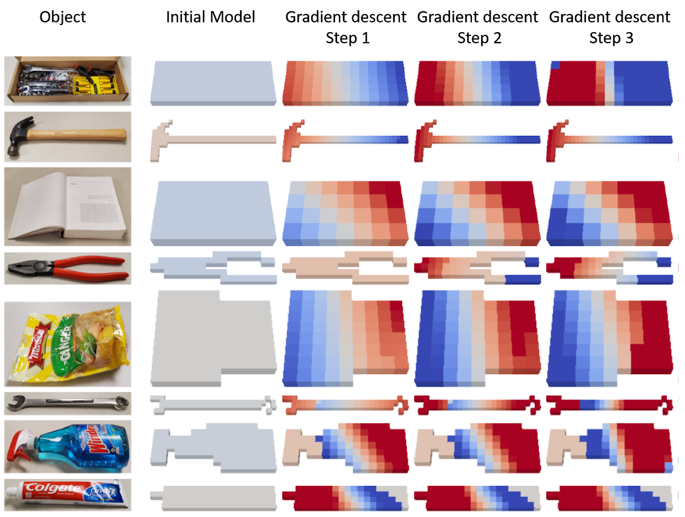
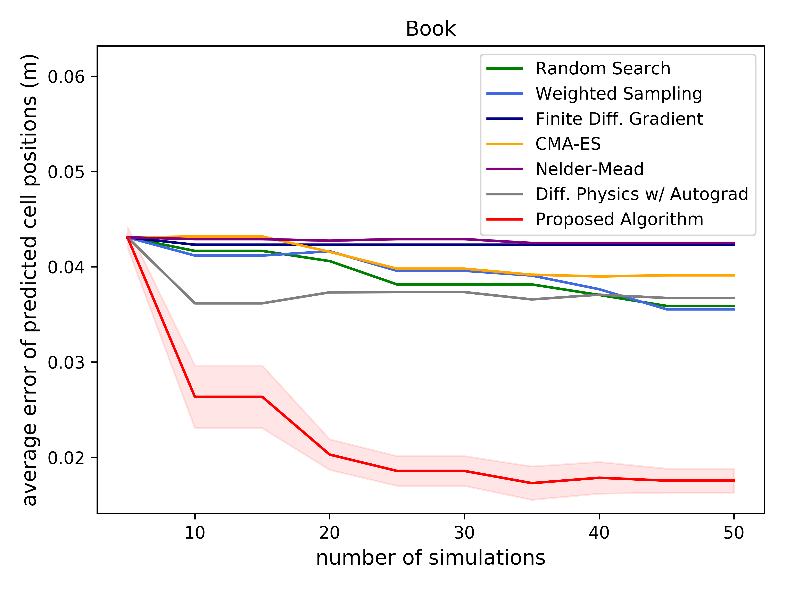
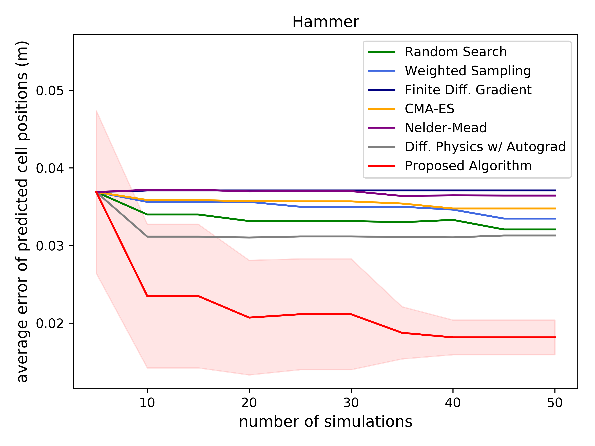
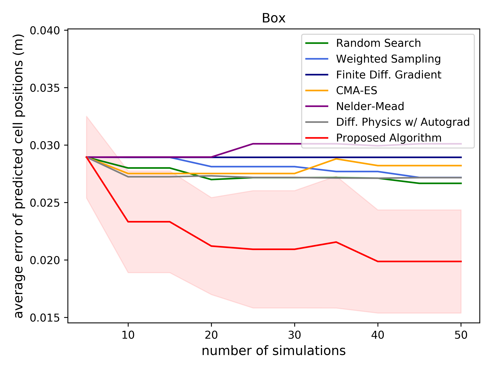
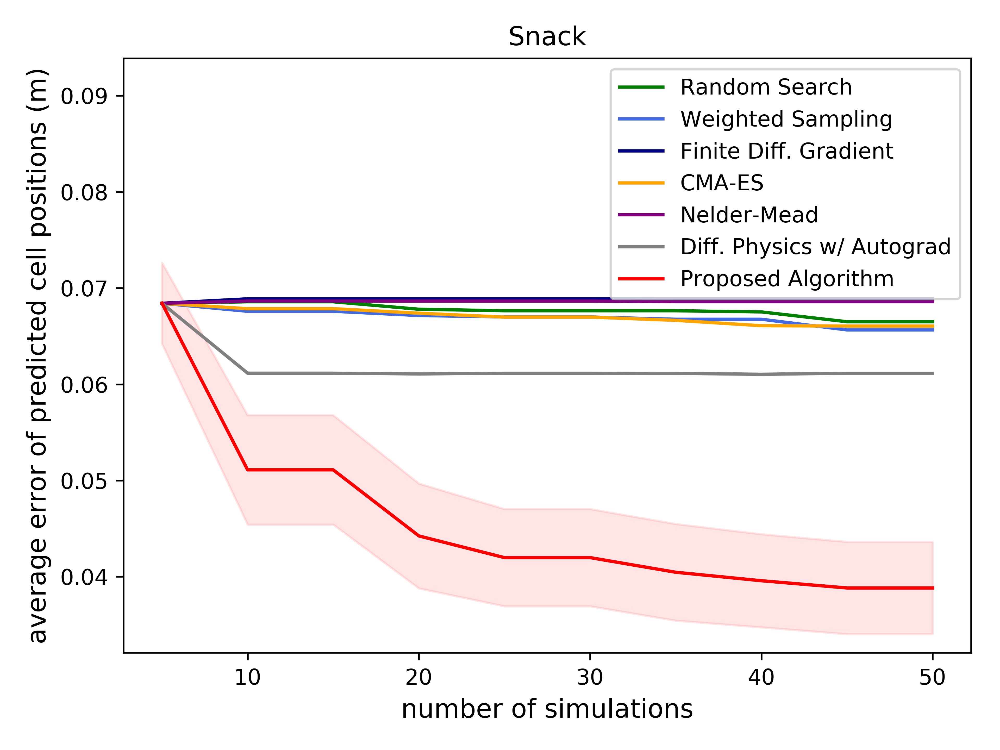
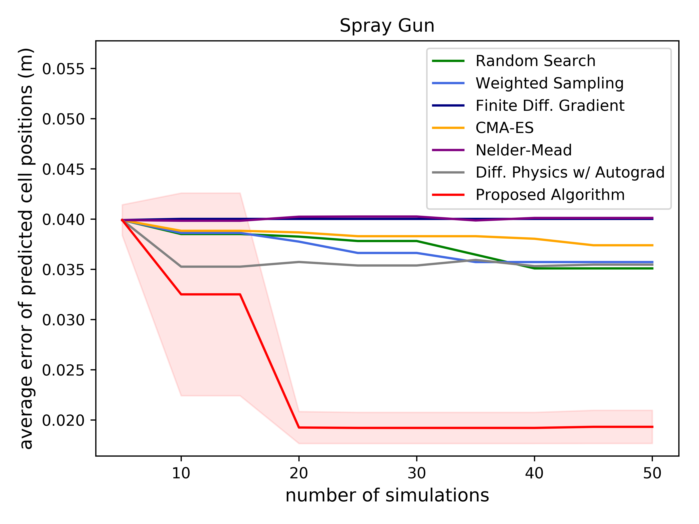
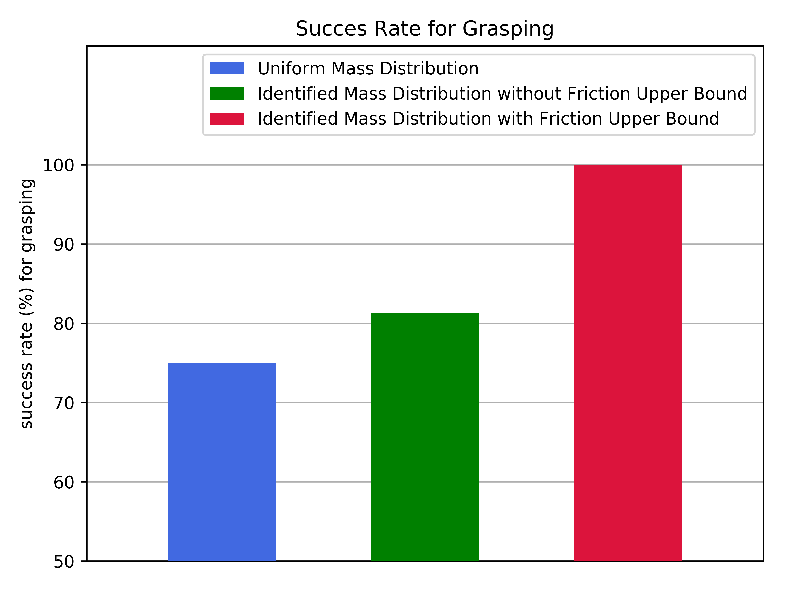
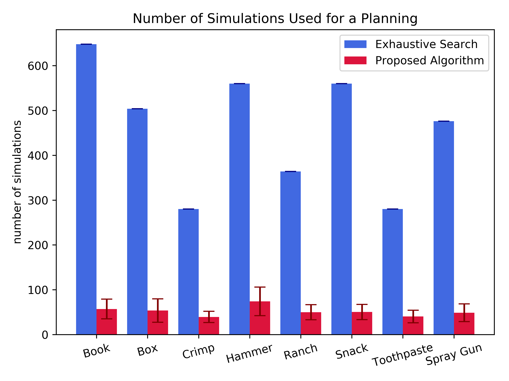

# Learning to Slide Unknown Objects with Differentiable Physics Simulations

Changkyu Song and Abdeslam Boularias, Learning to Slide Unknown Objects with Differentiable Physics Simulations, Robotics: Science and Systems (R:SS), July 14-16th, 2020, Oregon State University at Corvallis, Oregon, USA. [[PDF]](https://arxiv.org/pdf/2005.05456.pdf) [[Video]](https://www.youtube.com/watch?v=cHNnJNRQBPc) [[Project Page]](https://sites.google.com/site/changkyusong86/research/rss2020)

# Results

# Author

[Changkyu](https://sites.google.com/site/changkyusong86) (changkyusong86@gmail.com)

